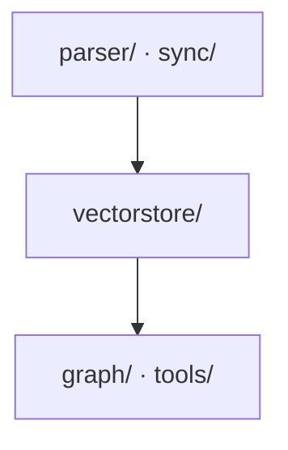

# README — section catalog

Each section: **purpose**, the **pattern**, and a **mini-example**. Use only the
sections a project needs (a library skips "Ports & Services"; a CLI skips
"Architecture"). Keep the order in `SKILL.md`.

---

## 1. Title + one-line what-it-is
**Purpose:** a stranger knows in 5 seconds what this is and what it's built on.
**Pattern:** `# Name` + one sentence naming the job and the core stack. Badges only for public repos.
```md
# Document Processing & RAG API
FastAPI backend for document ingestion, vector search, and AI-powered Q&A.
Built with **FastAPI**, **LangGraph**, **Qdrant**, and **Docling**.
```

## 2. What it does / why it exists
**Purpose:** the mental model before any command.
**Pattern:** 2–4 sentences, or a short bullet list of the "halves"/capabilities. Add a **design-principle callout** if the project has one guiding rule.
```md
> **Design principle:** every `POST` accepts an empty body — the generator
> auto-fills missing fields, so zero-input calls just work.
```

## 3. Ports & Services
**Purpose:** the moving parts and where they listen — before "getting started."
**Pattern:** table `Port · Service · Description`. (For non-services: a "Components" table.)
```md
| Port | Service | Description |
|------|---------|-------------|
| 8000 | FastAPI | Backend API (`/docs` for Swagger) |
| 6333 | Qdrant  | Vector DB REST |
| 6379 | Redis   | Chat history & cache |
```

## 4. Prerequisites
**Purpose:** what must exist before step 1; how to confirm it.
**Pattern:** table `Tool · Version · How to check · Install`. Note which are optional and when.
```md
| Tool   | Version | Check              | Install |
|--------|---------|--------------------|---------|
| Python | 3.10+   | `python --version` | python.org |
| Docker | any     | `docker --version` | docs.docker.com |
```

## 5. Getting Started
**Purpose:** zero → running, no guesswork.
**Pattern:** **numbered** steps, copy-paste blocks, **a verify line after the run step**. When there are two paths (local vs Docker), label them **Option A / Option B** and say which is recommended for what.
```md
### Option B: Docker (everything in containers)
1. `cp .env.example .env`  → fill in `LLM_API_KEY`
2. `docker compose up -d --build`
3. Verify → open **http://localhost:8000/docs** (Swagger loads)
```

## 6. Architecture
**Purpose:** how the pieces relate — *one* diagram that earns its place, plus a table.
**Pattern:** a `mermaid` flow/block diagram + a `Module · Role` table. Prefer one clear diagram to several. State the layering rule in a sentence.
```md

Each layer only talks to the one below it.

| Module | Role |
|--------|------|
| parser/ | raw sources → Document chunks |
| vectorstore/ | Qdrant hybrid search; knows nothing about parsing |
```

## 7. Where to put new code  ⭐
**Purpose:** the highest-leverage section for a living repo — turns "where does this go?" into a lookup.
**Pattern:** table `If you want to … · Put it in … · Example`. Cover the common change types (new endpoint, new integration, new tool, new config, schema).
```md
| If you want to add…        | Put it in…                       | Example |
|----------------------------|----------------------------------|---------|
| A new data-source          | `parser/integrations/<name>/`    | `…/notion/integration.py` |
| A new endpoint             | that module's `router.py`         | `parser/router.py` |
| A tool the agent can call  | `tools/`                         | `tools/tools.py` |
```

## 8. API / Endpoints
**Purpose:** the callable surface, scannable.
**Pattern:** **grouped** tables (by module/router), `Method · Path · Purpose`. Point to live docs (Swagger/OpenAPI) rather than duplicating request bodies. Flag auth (e.g. "requires `x-api-key`").
```md
### Chat
| Method | Path | Description |
|--------|------|-------------|
| POST | `/api/v1/graph/chat` | Chat with the assistant |
| POST | `/api/v1/graph/chat/streaming` | SSE streaming |
```

## 9. Configuration
**Purpose:** every knob, whether it's required, and the secrets policy.
**Pattern:** env-var table `Variable · Required · Description`; state where secrets live and what's server-only.
```md
| Variable | Required | Description |
|----------|----------|-------------|
| `LLM_API_KEY` | Yes | LLM provider key |
| `CLICKUP_API_TOKEN` | For ClickUp | starts with `pk_` |

> Secrets are read from server env only — never accepted from clients.
```

## 10. Workflow example
**Purpose:** the golden path, concretely, so a reader can reproduce a real result.
**Pattern:** 2–4 numbered real calls (ingest → search → ask), copy-paste.

## 11. Builders' tail — Design decisions · Code map
**Purpose:** the *why* and the *where*, for maintainers and agents. **Lives inline at the end of the README until it graduates** into `DECISIONS.md` / `REFERENCE.md` (see `doc-set.md`).
- **Design decisions** — `Decision · Why (and what we rejected)`. The rejected alternative is what makes it defensible.
- **Code map** — file-by-file `Path · Responsibility` table.
- **Invariants / gotchas** — a numbered "read before editing" list of things that break if changed wrong (identifier namespaces, "must be named exactly X", license bars, etc.).
- **Extending it** — an "add a new X (checklist)" and/or an ABC/interface contract.
```md
| Decision | Why it holds up (and what we rejected) |
|----------|----------------------------------------|
| Runtime = LangGraph (MIT) | native durable resume; MIT is resellable. Rejected Temporal (ops-heavy), n8n (fair-code). |
```

## 12. Docs map
**Purpose:** point to siblings and name the source of truth.
**Pattern:** a short list linking `REFERENCE.md` / `DECISIONS.md` / interactive docs, and where canonical truth lives (Swagger, a schema, Claude memory).
```md
- [REFERENCE.md](REFERENCE.md) — where the code lives
- [DECISIONS.md](DECISIONS.md) — decisions & the execution model
- Interactive API: **/docs** (Swagger) is the source of truth for request bodies
```
